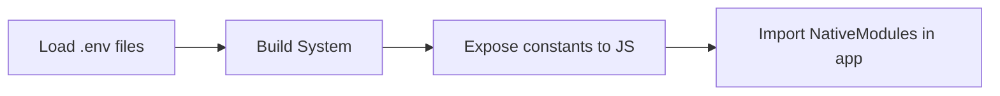

A common requirement for mobile apps is building the app to target a specific environment or uses a specific API key for your production environment versus your test one. From Part III of the [Twelve Factor App](https://12factor.net/):

>Store config in the environment

While it's certainly possible to accomplish the above with a package like [`react-native-config`](https://github.com/luggit/react-native-config) or by storing the configuration in your code then determining whether it's a release or debug build, there's a way to accomplish this in React Native using [Native Modules](https://facebook.github.io/react-native/docs/native-modules-setup). Here's the very simple overview of how this works in React Native:


I started my project with the [React Native CLI](https://facebook.github.io/react-native/docs/getting-started.html#the-react-native-cli) using `react-native init`.

All of the code can be found here: https://github.com/v1zix/ReactNativePlayground

In Part 1 I'm just going to go over how to expose build time constants to JavaScript and then use Native Modules to show them in the app.

## Native Modules in React Native

To actually get access to our environment variables I'm going off of the React Native docs for using Native Modules. Native Modules are used to allow JavaScript to interact with the native platform. Generally it's for interacting with platform APIs or writing higher performance code, but in this case the build systems on Android and iOS both have the ability to get build configuration values into native code. We can use this feature to get build configuration into our JavaScript code. Links to the Native Module guides:
* [iOS](https://facebook.github.io/react-native/docs/native-modules-ios)
* [Android](https://facebook.github.io/react-native/docs/native-modules-android)

Both of the guides have information on using constants, but the iOS guide has a specific [section on exporting constants](https://facebook.github.io/react-native/docs/native-modules-ios#exporting-constants). A nice part of exporting constants is that it's only done at initialization so we don't need to make a round-trip through the bridge. I'm going to use that part of the guide as a starter on how to get environment variables to JavaScript.

## Build Constants in iOS

To start we can use some of the build constants that come with our starter app, which are the version code and version name. These are going to be in `name-of-app/ios/name-of-app/Info.plist`. This file will be important because on iOS eventually the values in the `Info.plist` will be available in [`mainBundle`](https://developer.apple.com/documentation/foundation/nsbundle/1410786-mainbundle), which has a type of [`NSBundle`](https://developer.apple.com/documentation/foundation/nsbundle), when the app is built. In `Info.plist` it should have something like this:

```xml
<?xml version="1.0" encoding="UTF-8"?>
<!DOCTYPE plist PUBLIC "-//Apple//DTD PLIST 1.0//EN" "http://www.apple.com/DTDs/PropertyList-1.0.dtd">
<plist version="1.0">
<dict>
<!-- Omit some lines -->
	<key>CFBundleShortVersionString</key>
	<string>1.0</string>
	<key>CFBundleSignature</key>
	<string>????</string>
	<key>CFBundleVersion</key>
	<string>1</string>
<!-- Omit some lines -->
</dict>
</plist>
```

Here's the code that will expose these constants on the native side located in the directory `name-of-app/ios/`:

```objectivec
// ios/BuildConstants.h
#ifndef BuildConstants_h
#define BuildConstants_h

#import <React/RCTBridgeModule.h>

@interface BuildConstants : NSObject <RCTBridgeModule>
@end

#endif
```

```objectivec
// ios/BuildContants.m
#import <Foundation/Foundation.h>
#import "BuildConstants.h"

@implementation BuildConstants

RCT_EXPORT_MODULE();

- (NSDictionary *)constantsToExport
{
  NSString *versionCode = [[NSBundle mainBundle] objectForInfoDictionaryKey:@"CFBundleVersion"];
  NSString *versionName = [[NSBundle mainBundle] objectForInfoDictionaryKey:@"CFBundleShortVersionString"];
  return @{
           @"versionCode": versionCode,
           @"versionName": versionName
           };
}

+ (BOOL)requiresMainQueueSetup
{
  return YES;  // only do this if your module initialization relies on calling UIKit!
}

@end
```

This will export the constants to be available to JavaScript, but without actually importing them in our JavaScript nothing will change in the app itself. Note that the name of the module in your iOS native code should probably be the same as the name in Android for clarity and convenience. I've named the module `BuildConstants` here. I'll go over the same process in Android then show how to use these values in the app.

## Build Constants in Android

On Android there is no `Info.plist`, but instead it's in `name-of-app/android/app/build.gradle`. In `android.defaultConfig` it should have something like this specificed for version code and version name:

```groovy{13-14}
android {
    compileSdkVersion rootProject.ext.compileSdkVersion

    compileOptions {
        sourceCompatibility JavaVersion.VERSION_1_8
        targetCompatibility JavaVersion.VERSION_1_8
    }

    defaultConfig {
        applicationId "com.yourappname"
        minSdkVersion rootProject.ext.minSdkVersion
        targetSdkVersion rootProject.ext.targetSdkVersion
        versionCode 1
        versionName "1.0"
    }
    // ...omitted the rest
}
```
When a build is completed on Android a Java file will be generated that exposes the constants given to Gradle. That file should be located here for a debug build: `name-of-app/android/app/build/generated/source/buildConfig/debug/com/name-of-app/BuildConfig.java`

Then we can import that Java file like any other. Here's the code:
```java
// android/app/src/main/java/com/reactnativeplayground/constants/BuildConstantsModule.java
package com.reactnativeplayground.constants;

import com.reactnativeplayground.BuildConfig;

import com.facebook.react.bridge.NativeModule;
import com.facebook.react.bridge.ReactApplicationContext;
import com.facebook.react.bridge.ReactContext;
import com.facebook.react.bridge.ReactContextBaseJavaModule;

import java.util.Map;
import java.util.HashMap;

public class BuildConstantsModule extends ReactContextBaseJavaModule {

  public BuildConstantsModule(ReactApplicationContext reactContext) {
    super(reactContext);
  }

  @Override
  public String getName() {
    return "BuildConstants";
  }

  @Override
  public Map<String, Object> getConstants() {
    final Map<String, Object> constants = new HashMap<>();
    constants.put("versionCode", BuildConfig.VERSION_CODE);
    constants.put("versionName", BuildConfig.VERSION_NAME);
    return constants;
  }
}
```

Note the `getName()` method above uses `BuildConstants` to match the name we're using in the previous Objective-C code. This allows us to import `NativeModules.BuildConstants` once and have access to the same values on both platforms. We'll see this in the next section.

```java
// android/app/src/main/java/com/reactnativeplayground/constants/BuildConstantsPackage.java
package com.reactnativeplayground.constants;

import com.facebook.react.ReactPackage;
import com.facebook.react.bridge.NativeModule;
import com.facebook.react.bridge.ReactApplicationContext;
import com.facebook.react.uimanager.ViewManager;

import java.util.ArrayList;
import java.util.Collections;
import java.util.List;

public class BuildConstantsPackage implements ReactPackage {

  @Override
  public List<ViewManager> createViewManagers(ReactApplicationContext reactContext) {
    return Collections.emptyList();
  }

  @Override
  public List<NativeModule> createNativeModules(
                              ReactApplicationContext reactContext) {
    List<NativeModule> modules = new ArrayList<>();

    modules.add(new BuildConstantsModule(reactContext));

    return modules;
  }

}
```

Then we need to include this package in `MainApplication.java`:
```java{4,18}
import com.facebook.react.ReactPackage;
import com.facebook.react.shell.MainReactPackage;
import com.facebook.soloader.SoLoader;
import com.reactnativeplayground.constants.BuildConstantsPackage;

import java.util.Arrays;
import java.util.List;
public class MainApplication extends Application implements ReactApplication {
  private final ReactNativeHost mReactNativeHost = new ReactNativeHost(this) {
    @Override
    public boolean getUseDeveloperSupport() {
      return BuildConfig.DEBUG;
    }
    @Override
    protected List<ReactPackage> getPackages() {
      return Arrays.<ReactPackage>asList(
          new MainReactPackage(),
          new BuildConstantsPackage()
      );
    }
```

## Import Build Constants in JavaScript

Now we have to import `NativeModules` and use the build constants in the app. In the same directory as your `App.js` with the starter app create a file called `BuildConstantsExample.js`:

```js
import { NativeModules } from 'react-native';
module.exports = NativeModules.BuildConstants;
```

You don't actually need the file above since it's just syntactic sugar but doing it that way we can use it to import it in `App.js` like this:

```jsx{3,20-22}
import React, { Component } from 'react';
import { Platform, StyleSheet, Text, View } from 'react-native';
import BuildConstants from './BuildConstantsExample';

const instructions = Platform.select({
  ios: 'Press Cmd+R to reload,\n' + 'Cmd+D or shake for dev menu',
  android:
    'Double tap R on your keyboard to reload,\n' +
    'Shake or press menu button for dev menu',
});

type Props = {};
export default class App extends Component<Props> {
  render() {
    return (
      <View style={styles.container}>
        <Text style={styles.welcome}>Welcome to React Native!</Text>
        <Text style={styles.instructions}>To get started, edit App.js</Text>
        <Text style={styles.instructions}>{instructions}</Text>
        <Text style={styles.instructions}>Build constants below!</Text>
        <Text style={styles.instructions}>Version code: {BuildConstants.versionCode}</Text>
        <Text style={styles.instructions}>Version name: {BuildConstants.versionName}</Text>
      </View>
    );
  }
}
```

Now when you run the app, you should see the version code and version name appear: 


In Part 2, I'll go over adding environment files to load these kinds of build constants into the build system and then using them in the app.